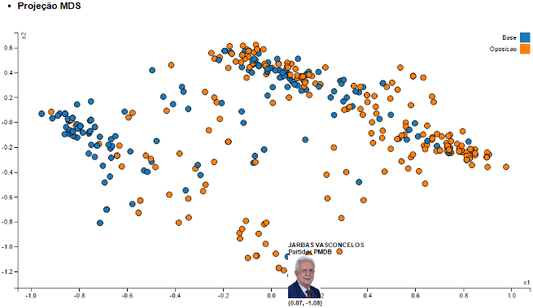
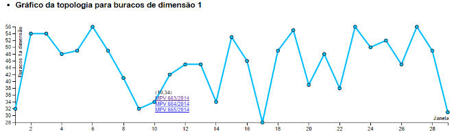

# Análise de votações

Este código faz uma [análise topológica](https://en.wikipedia.org/wiki/Persistent_homology) das votações na camâmara dos deputados durante um ano em particular.

A ideia é analisar como a topologia dos dados varia ao longo do tempo.

Para realizar a análise, séries temporais das votações são geradas, considerando os seguintes valores:

* Valor  1: voto sim
* Valor -1: voto não
* Valor  0: abstenção ou ausência do voto

Para gerar pontos no espaço a partir das séries temporais, calcula-se a correlação de [Spearman](https://en.wikipedia.org/wiki/Spearman%27s_rank_correlation_coefficient), a qual é convertida para uma distância usando a equação `D = 1 - S`. Os pontos são gerados por meio de [Multidimensional Scaling](https://en.wikipedia.org/wiki/Multidimensional_scaling).

Passando o mouse sobre um ponto é possível ver a qual deputado ele corresponde.

No gráfico do número de buracos topológicos é possível ver quais votações ocorreram em cada janela, para isso basta passar o mouse sobre os pontos.

## Executar o projeto

Para ver a ferramenta executando, sem a necessidade de refazer o download dos dados, basta subir as pastas `dados` e `html` para um servidor web. Para testes rápidos, recomendo o [http-server](https://www.npmjs.com/package/http-server) do [Node.js](https://nodejs.org/en/). Basta iniciar o `http-server` na pasta do projeto e apontar o navegador para <http://localhost:8080/html/ferramenta.html>

## Obter dados e executar a análise

### Dependências:
* Python 3
    * [SUDS-jurko](https://bitbucket.org/jurko/suds) - instalar via pip
* R 3.2+
    * [jsonlite](https://cran.r-project.org/web/packages/jsonlite/index.html)
    * [TDA](https://cran.r-project.org/package=TDA)

### Executando o código

* No arquivo `src/params.json`, deve-se configurar o parâmetro `workingdir` para o diretório no qual o projeto foi clonado.
* Os outros parâmetros que podem ser opcionalmente configurados no arquivo `src/params.json` são:
    * `ano`: o ano no qual deseja-se realizar a análise. Observe que a API da Câmara fornece apenas a lista de deputados em exercício, portanto caso deseje-se fazer a análise considerando vários anos atrás, é possível que poucos dos deputados atuais tenham participado das votações desse ano.
    * `W`: o tamanho da janela de análise. Por exemplo, "W = 20" significa considerar 20 votações em cada janela.
    * `slide`: o deslocamento para a janela deslizante, ou seja, quantos pontos da janela atual são esquecidos e trocados por novos.
    * `threshold`: o tempo de vida mínimo para considerar contabilizar um buraco.

Caso esteja utilizando Windows, os scripts do PowerShell `clean.ps1` e `run-all.ps1` são fornecidos para limpar os dados e executar a análise, respectivamente. Altere as variáveis `R_EXEC` e `PYTHON_EXEC` para os caminhos do R e Python 3 no seu sistema.

De maneira similar, para Mac/Linux os scritps bash `clean.sh` e `run-all.sh` são fornecidos. As variáveis `R_EXEC` e `PYTHON_EXEC` também devem ser alteradas nesse caso.

